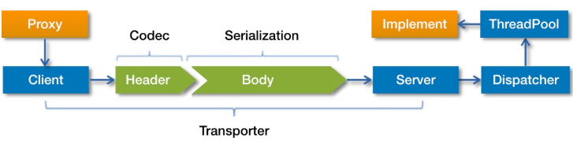
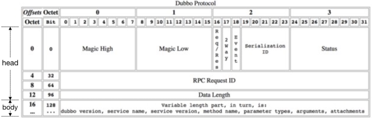
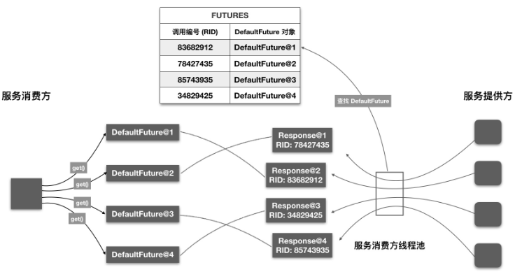

## 框架设计
http://dubbo.apache.org/zh-cn/docs/dev/design.html

### Dubbo中常用有7个标签。
分为三个类别：公用标签，服务提供者标签，服务消费者标签，

#### 1、公用标签

<dubbo:application/>和  <dubbo:registry/>

A、配置应用信息

    <dubbo:application name="服务的名称"/>

B、配置注册中心

    <dubbo:registry address="ip:port" protocol="协议"/>

#### 2、服务提供者标签

A、配置服务提供者

    <dubbo:provider/>设置<dubbo:service>和<dubbo:protocol>标签的默认值  
    <dubbo:provider protocol="协议" host="主机 ip" />
B、配置服务提供者的访问协议

    <dubbo:protocol name="dubbo" port="20880"/>
C、配置服务提供者暴露自己的服务

    <dubbo:service interface="服务接口名"  ref="服务实现对象 bean">

#### 3、服务消费者标签

A、配置服务消费者的默认值

    <dubbo:consumer/>  配置服务消费者的默认值，即<dubbo:reference>标签的默认值
    <dubbo:consumertimeout=”1000” retries=”2”  />  默认远程连接超时 1000 毫秒，重新连接次数 2
B、配置服务消费者引用服务

    <dubbo:referenceid=”服务引用 bean 的 id” interface=”服务接口名”/>

### Dubbo源码阅读顺序

原文链接：https://blog.csdn.net/heroqiang/article/details/85340958

### java spi 和dubbo spi 的区别
#### 1、JDK SPI
JDK 标准的 SPI 会一次性加载所有的扩展实现，如果有的扩展吃实话很耗时，但
也没用上，很浪费资源。
所以只希望加载某个的实现，就不现实了

#### DUBBO SPI
1，对 Dubbo 进行扩展，不需要改动 Dubbo 的源码
2，延迟加载，可以一次只加载自己想要加载的扩展实现。
3，增加了对扩展点 IOC 和 AOP 的支持，一个扩展点可以直接 setter 注入其它扩展点。
3，Dubbo 的扩展机制能很好的支持第三方 IoC 容器，默认支持 Spring Bean。

### 自适应扩展机制
首先 Dubbo 会为拓展接口生成具有代理功能的代码。然后通过 javassist 或 jdk 编译这段代码，得到 Class 类。
最后再通过反射创建代理类，在代理类中，就可以通过URL对象的参数来确定到底调用哪个实现类。

### dubbo ioc
Dubbo IOC 是通过 setter 方法注入依赖。Dubbo 首先会通过反射获取到实例的所有方法，然后再遍历方法列表，检测方法名是否具有 setter 方法特征。
若有，则通过 ObjectFactory 获取依赖对象，最后通过反射调用 setter 方法将依赖设置到目标对象中。

### dubbo 服务导出
Dubbo 服务导出过程始于 Spring 容器发布刷新事件，Dubbo 在接收到事件后，会立即执行服务导出逻辑。
整个逻辑大致可分为三个部分，
第一部分是前置工作，主要用于检查参数，组装 URL。
第二部分是导出服务，包含导出服务到本地 (JVM)，和导出服务到远程两个过程。
ZookeeperClient第三部分是向注册中心注册服务，用于服务发现。
#### 节点创建
以 Zookeeper 为例，所谓的服务注册，本质上是将服务配置数据写入到 Zookeeper 的某个路径的节点下。为了让大家有一个直观的了解，下面我们将 Dubbo 的 demo 跑起来，然后通过 Zookeeper 可视化客户端 ZooInspector 查看节点数据。如下：

从上图中可以看到 com.alibaba.dubbo.demo.DemoService 这个服务对应的配置信息（存储在 URL 中）最终被注册到了 /dubbo/com.alibaba.dubbo.demo.DemoService/providers/ 节点下。

### dubbo 服务引用
Dubbo 服务引用的时机有两个，第一个是在 Spring 容器调用 ReferenceBean 的 afterPropertiesSet 方法时引用服务，
第二个是在 ReferenceBean 对应的服务被注入到其他类中时引用。这两个引用服务的时机区别在于，第一个是饿汉式的，第二个是懒汉式的。
默认情况下，Dubbo 使用懒汉式引用服务。如果需要使用饿汉式，可通过配置 <dubbo:reference> 的 init 属性开启。
下面我们按照 Dubbo 默认配置进行分析，整个分析过程从 ReferenceBean 的 getObject 方法开始。当我们的服务被注入到其他类中时，
Spring 会第一时间调用 getObject 方法，并由该方法执行服务引用逻辑。按照惯例，在进行具体工作之前，需先进行配置检查与收集工作。
接着根据收集到的信息决定服务用的方式，有三种，第一种是引用本地 (JVM) 服务，第二是通过直连方式引用远程服务，第三是通过注册中心引用远程服务。
不管是哪种引用方式，最后都会得到一个 Invoker 实例。如果有多个注册中心，多个服务提供者，这个时候会得到一组 Invoker 实例，
此时需要通过集群管理类 Cluster 将多个 Invoker 合并成一个实例。合并后的 Invoker 实例已经具备调用本地或远程服务的能力了，
但并不能将此实例暴露给用户使用，这会对用户业务代码造成侵入。此时框架还需要通过代理工厂类 (ProxyFactory) 为服务接口生成代理类，
并让代理类去调用 Invoker 逻辑。避免了 Dubbo 框架代码对业务代码的侵入，同时也让框架更容易使用。

Invoker 是 Dubbo 的核心模型，代表一个可执行体。在服务提供方，Invoker 用于调用服务提供类。在服务消费方，Invoker 用于执行远程调用。Invoker 是由 Protocol 实现类构建而来。

### 服务字典
服务目录是什么。服务目录中存储了一些和服务提供者有关的信息，通过服务目录，服务消费者可获取到服务提供者的信息，比如 ip、端口、服务协议等。通过这些信息，
服务消费者就可通过 Netty 等客户端进行远程调用。在一个服务集群中，服务提供者数量并不是一成不变的，如果集群中新增了一台机器，相应地在服务目录中就要新增一条服务提供者记录。
或者，如果服务提供者的配置修改了，服务目录中的记录也要做相应的更新。如果这样说，服务目录和注册中心的功能不就雷同了吗？确实如此，这里这么说是为了方便大家理解。
实际上服务目录在获取注册中心的服务配置信息后，会为每条配置信息生成一个 Invoker 对象，并把这个 Invoker 对象存储起来，这个 Invoker 才是服务目录最终持有的对象。
Invoker 有什么用呢？看名字就知道了，这是一个具有远程调用功能的对象。讲到这大家应该知道了什么是服务目录了，它可以看做是 Invoker 集合，
且这个集合中的元素会随注册中心的变化而进行动态调整。

### 服务路由
服务路由是什么。服务路由包含一条路由规则，路由规则决定了服务消费者的调用目标，即规定了服务消费者可调用哪些服务提供者。Dubbo 目前提供了三种服务路由实现，
分别为条件路由 ConditionRouter、脚本路由 ScriptRouter 和标签路由 TagRouter。其中条件路由是我们最常使用的，标签路由是一个新的实现，暂时还未发布，
该实现预计会在 2.7.x 版本中发布。

### 集群
在对集群相关代码进行分析之前，这里有必要先来介绍一下集群容错的所有组件。包含 Cluster、Cluster Invoker、Directory、Router 和 LoadBalance 等。

集群工作过程可分为两个阶段，第一个阶段是在服务消费者初始化期间，集群 Cluster 实现类为服务消费者创建 Cluster Invoker 实例，即上图中的 merge 操作。
第二个阶段是在服务消费者进行远程调用时。以 FailoverClusterInvoker 为例，该类型 Cluster Invoker 首先会调用 Directory 的 list 方法列举 Invoker 
列表（可将 Invoker 简单理解为服务提供者）。Directory 的用途是保存 Invoker，可简单类比为 List<Invoker>。其实现类 RegistryDirectory 是一个动态服务目录，
可感知注册中心配置的变化，它所持有的 Invoker 列表会随着注册中心内容的变化而变化。每次变化后，RegistryDirectory 会动态增删 Invoker，并调用 Router 的 route 
方法进行路由，过滤掉不符合路由规则的 Invoker。当 FailoverClusterInvoker 拿到 Directory 返回的 Invoker 列表后，它会通过 LoadBalance 从 Invoker 
列表中选择一个 Invoker。最后 FailoverClusterInvoker 会将参数传给 LoadBalance 选择出的 Invoker 实例的 invoke 方法，进行真正的远程调用。

以上就是集群工作的整个流程，这里并没介绍集群是如何容错的。Dubbo 主要提供了这样几种容错方式：
- Failover Cluster - 失败自动切换
- Failfast Cluster - 快速失败
- Failsafe Cluster - 失败安全
- Failback Cluster - 失败自动恢复
- Forking Cluster - 并行调用多个服务提供者

### 负载均衡
LoadBalance 中文意思为负载均衡，它的职责是将网络请求，或者其他形式的负载“均摊”到不同的机器上。避免集群中部分服务器压力过大，而另一些服务器比较空闲的情况。
通过负载均衡，可以让每台服务器获取到适合自己处理能力的负载。在为高负载服务器分流的同时，还可以避免资源浪费，一举两得。负载均衡可分为软件负载均衡和硬件负载均衡。
在我们日常开发中，一般很难接触到硬件负载均衡。但软件负载均衡还是可以接触到的，比如 Nginx。在 Dubbo 中，也有负载均衡的概念和相应的实现。
Dubbo 需要对服务消费者的调用请求进行分配，避免少数服务提供者负载过大。服务提供者负载过大，会导致部分请求超时。因此将负载均衡到每个服务提供者上，是非常必要的。
Dubbo 提供了4种负载均衡实现，分别是
- 基于权重随机算法的 RandomLoadBalance、
- 基于最少活跃调用数算法的 LeastActiveLoadBalance、
- 基于 hash 一致性的 ConsistentHashLoadBalance，
- 以及基于加权轮询算法的 RoundRobinLoadBalance。

这几个负载均衡算法代码不是很长，但是想看懂也不是很容易，需要大家对这几个算法的原理有一定了解才行。如果不是很了解，也没不用太担心。我们会在分析每个算法的源码之前，
对算法原理进行简单的讲解，帮助大家建立初步的印象。

### 服务调用过程
Dubbo 服务调用过程比较复杂，包含众多步骤，比如发送请求、编解码、服务降级、过滤器链处理、序列化、线程派发以及响应请求等步骤。限于篇幅原因，本篇文章无法对所有的步骤一一进行分析。
本篇文章将会重点分析请求的发送与接收、编解码、线程派发以及响应的发送与接收等过程，至于服务降级、过滤器链和序列化大家自行进行分析，也可以将其当成一个黑盒，暂时忽略也没关系。

#### Dubbo 服务调用过程。

首先服务消费者通过代理对象 Proxy 发起远程调用，接着通过网络客户端 Client 将编码后的请求发送给服务提供方的网络层上，也就是 Server。Server 在收到请求后，
首先要做的事情是对数据包进行解码。然后将解码后的请求发送至分发器 Dispatcher，再由分发器将请求派发到指定的线程池上，最后由线程池调用具体的服务。
这就是一个远程调用请求的发送与接收过程。至于响应的发送与接收过程，这张图中没有表现出来。对于这两个过程，我们也会进行详细分析。

#### 服务调用方式
Dubbo 支持同步和异步两种调用方式，其中异步调用还可细分为“有返回值”的异步调用和“无返回值”的异步调用。所谓“无返回值”异步调用是指服务消费方只管调用，
但不关心调用结果，此时 Dubbo 会直接返回一个空的 RpcResult。若要使用异步特性，需要服务消费方手动进行配置。默认情况下，Dubbo 使用同步调用方式。
#### 为了便于大家阅读代码，这里以 DemoService 为例，将 sayHello 方法的整个调用路径贴出来。
    proxy0#sayHello(String)
      —> InvokerInvocationHandler#invoke(Object, Method, Object[])
        —> MockClusterInvoker#invoke(Invocation)
          —> AbstractClusterInvoker#invoke(Invocation)
            —> FailoverClusterInvoker#doInvoke(Invocation, List<Invoker<T>>, LoadBalance)
              —> Filter#invoke(Invoker, Invocation)  // 包含多个 Filter 调用
                —> ListenerInvokerWrapper#invoke(Invocation) 
                  —> AbstractInvoker#invoke(Invocation) 
                    —> DubboInvoker#doInvoke(Invocation)
                      —> ReferenceCountExchangeClient#request(Object, int)
                        —> HeaderExchangeClient#request(Object, int)
                          —> HeaderExchangeChannel#request(Object, int)
                            —> AbstractPeer#send(Object)
                              —> AbstractClient#send(Object, boolean)
                                —> NettyChannel#send(Object, boolean)
                                  —> NioClientSocketChannel#write(Object)
#### 请求编码
Dubbo 数据包结构。

Dubbo 数据包分为消息头和消息体，消息头用于存储一些元信息，比如魔数（Magic），数据包类型（Request/Response），消息体长度（Data Length）等。
消息体中用于存储具体的调用消息，比如方法名称，参数列表等。下面简单列举一下消息头的内容。   

    偏移量(Bit)	字段	取值
    0 ~ 7	魔数高位	0xda00
    8 ~ 15	魔数低位	0xbb
    16	数据包类型	0 - Response, 1 - Request
    17	调用方式	仅在第16位被设为1的情况下有效，0 - 单向调用，1 - 双向调用
    18	事件标识	0 - 当前数据包是请求或响应包，1 - 当前数据包是心跳包
    19 ~ 23	序列化器编号	2 - Hessian2Serialization
    3 - JavaSerialization
    4 - CompactedJavaSerialization
    6 - FastJsonSerialization
    7 - NativeJavaSerialization
    8 - KryoSerialization
    9 - FstSerialization
    24 ~ 31	状态	20 - OK
    30 - CLIENT_TIMEOUT
    31 - SERVER_TIMEOUT
    40 - BAD_REQUEST
    50 - BAD_RESPONSE
    ......
    32 ~ 95	请求编号	共8字节，运行时生成
    96 ~ 127	消息体长度	运行时计算

#### 调用服务
解码器将数据包解析成 Request 对象后，NettyHandler 的 messageReceived 方法紧接着会收到这个对象，并将这个对象继续向下传递。
这期间该对象会被依次传递给 NettyServer、MultiMessageHandler、HeartbeatHandler 以及 AllChannelHandler。
最后由 AllChannelHandler 将该对象封装到 Runnable 实现类对象中，并将 Runnable 放入线程池中执行后续的调用逻辑。整个调用栈如下：

    NettyHandler#messageReceived(ChannelHandlerContext, MessageEvent)
      —> AbstractPeer#received(Channel, Object)
        —> MultiMessageHandler#received(Channel, Object)
          —> HeartbeatHandler#received(Channel, Object)
            —> AllChannelHandler#received(Channel, Object)
              —> ExecutorService#execute(Runnable)    // 由线程池执行后续的调用逻辑
#### 线程派发模型
Dubbo 将底层通信框架中接收请求的线程称为 IO 线程。如果一些事件处理逻辑可以很快执行完，比如只在内存打一个标记，此时直接在 IO 线程上执行该段逻辑即可。
但如果事件的处理逻辑比较耗时，比如该段逻辑会发起数据库查询或者 HTTP 请求。此时我们就不应该让事件处理逻辑在 IO 线程上执行，而是应该派发到线程池中去执行。
原因也很简单，IO 线程主要用于接收请求，如果 IO 线程被占满，将导致它不能接收新的请求。

如上图，红框中的 Dispatcher 就是线程派发器。需要说明的是，Dispatcher 真实的职责创建具有线程派发能力的 ChannelHandler，比如 AllChannelHandler、
MessageOnlyChannelHandler 和 ExecutionChannelHandler 等，其本身并不具备线程派发能力。Dubbo 支持 5 种不同的线程派发策略，下面通过一个表格列举一下。

    策略	用途
    all	所有消息都派发到线程池，包括请求，响应，连接事件，断开事件等
    direct	所有消息都不派发到线程池，全部在 IO 线程上直接执行
    message	只有请求和响应消息派发到线程池，其它消息均在 IO 线程上执行
    execution	只有请求消息派发到线程池，不含响应。其它消息均在 IO 线程上执行
    connection	在 IO 线程上，将连接断开事件放入队列，有序逐个执行，其它消息派发到线程池
默认配置下，Dubbo 使用 all 派发策略，即将所有的消息都派发到线程池中。下面我们来分析一下 AllChannelHandler 的代码。
#### 整个服务调用过程
    ChannelEventRunnable#run()
      —> DecodeHandler#received(Channel, Object)
        —> HeaderExchangeHandler#received(Channel, Object)
          —> HeaderExchangeHandler#handleRequest(ExchangeChannel, Request)
            —> DubboProtocol.requestHandler#reply(ExchangeChannel, Object)
              —> Filter#invoke(Invoker, Invocation)
                —> AbstractProxyInvoker#invoke(Invocation)
                  —> Wrapper0#invokeMethod(Object, String, Class[], Object[])
                    —> DemoServiceImpl#sayHello(String)

本篇文章在多个地方都强调过调用编号很重要，但一直没有解释原因，这里简单说明一下。一般情况下，服务消费方会并发调用多个服务，每个用户线程发送请求后，
会调用不同 DefaultFuture 对象的 get 方法进行等待。 一段时间后，服务消费方的线程池会收到多个响应对象。这个时候要考虑一个问题，
如何将每个响应对象传递给相应的 DefaultFuture 对象，且不出错。答案是通过调用编号。DefaultFuture 被创建时，会要求传入一个 Request 对象。
此时 DefaultFuture 可从 Request 对象中获取调用编号，并将 <调用编号, DefaultFuture 对象> 映射关系存入到静态 Map 中，即 FUTURES。
线程池中的线程在收到 Response 对象后，会根据 Response 对象中的调用编号到 FUTURES 集合中取出相应的 DefaultFuture 对象，然后再将 Response 
对象设置到 DefaultFuture 对象中。最后再唤醒用户线程，这样用户线程即可从 DefaultFuture 对象中获取调用结果了。整个过程大致如下图：
